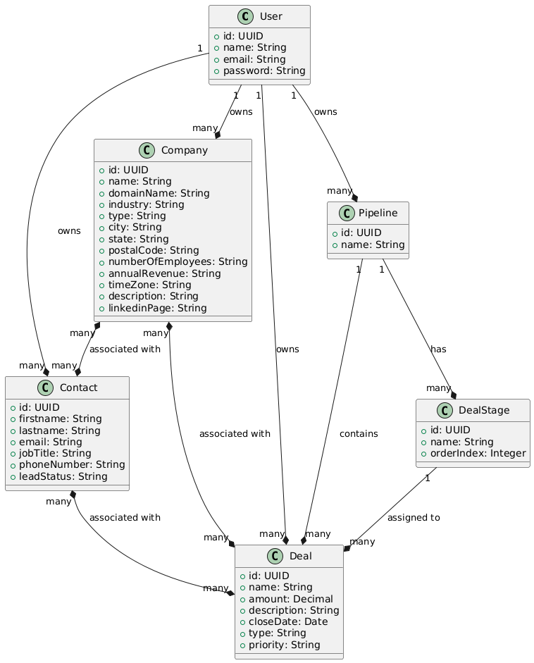

# customerflow-api

## Overview
CustomerFlow is a CRM software designed to manage customer relationships, business opportunities, and the organization of commercial processes. Developed in Java, Spring Boot and Oracle DB.

## Features
- Users management
- Contacts management
- Companies management
- Deals management

## Class diagram




<details>
  <summary>Diagram code in PlantUML (planttext.com)</summary>

```
@startuml

class User {
    +id: UUID
    +name: String
    +email: String
    +password: String
}

class Contact {
    +id: UUID
    +firstname: String
    +lastname: String
    +email: String
    +jobTitle: String
    +phoneNumber: String
    +leadStatus: String
}

class Company {
    +id: UUID
    +name: String
    +domainName: String
    +industry: String
    +type: String
    +city: String
    +state: String
    +postalCode: String
    +numberOfEmployees: String
    +annualRevenue: String
    +timeZone: String
    +description: String
    +linkedinPage: String
}

class Deal {
    +id: UUID
    +name: String
    +amount: Decimal
    +description: String
    +closeDate: Date
    +type: String
    +priority: String
}

class Pipeline {
    +id: UUID
    +name: String
}

class DealStage {
    +id: UUID
    +name: String
    +orderIndex: Integer
}

User "1" --* "many" Company : owns
User "1" --* "many" Contact : owns
User "1" --* "many" Deal : owns
User "1" --* "many" Pipeline : owns
Company "many" *--* "many" Contact: associated with
Company "many" *--* "many" Deal : associated with
Contact "many" *--* "many" Deal : associated with

Pipeline "1" --* "many" DealStage : has
Pipeline "1" --* "many" Deal : contains
DealStage "1" --* "many" Deal : assigned to

@enduml
```

</details>

## Used Technologies

- Backend:
  - Java 17
  - Spring Web
  - Spring Data JPA
  - Oracle Driver
  - Spring Security
  - Lombok
  - Validation
  - ModelMapper
  - SpringDoc (OpenAPI and Swagger UI)
- Database: 
  - Oracle Database Free

## Running in Development Environment

1. Run Oracle DB server
    ```zsh
    docker compose up -d
    ```
2. Start app from IDE:
    ```zsh
    mvn spring-boot:run
    ```

## Running in Testing Environment

The following command will buill an image and run a container of the API with the database server.
```zsh
docker compose -f docker-compose-testing.yml up -d  
```